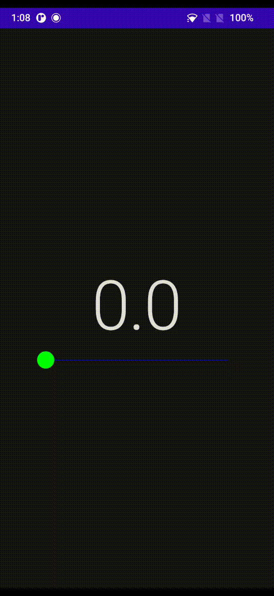

# sliding-bar

[View Releases and Changelog](https://github.com/cybercoder-naj/sliding-bar/releases)

[](https://github.com/tterb/atomic-design-ui/blob/master/LICENSEs)
[](https://jitpack.io/#cybercoder-naj/sliding-bar)

Slider Composable for the Jetpack Compose UI-toolkit for Android Application Development

## Demo



## Installation

Add JitPack url to your `settings.gradle` file

```bash
  repositories {
    maven { url 'https://jitpack.io' }
  }
```

And the dependency in your app `build.gradle` file

```bash
  dependencies {
    implementation "com.github.cybercoder-naj:sliding-bar:$version"
  }
```

## Usage/Examples

Remember to add the `@ExperimentalComposeUiApi` annotation to your class/function.

```kotlin
SlidingBar(
    value = value,
    onValueChanged = { value = it },
    modifier = Modifier
        .padding(horizontal = 64.dp)
        .fillMaxWidth(),
    colors = SlidingBarDefaults.colors(
        colorPrimary = Color.Green,
        colorTrack = Color.Blue
    ),
    valueRange = 0f..30f,
    stepSize = 1f
)
```

## Contributing

Contributions are always welcome!

See [CONTRIBUTING.md](CONTRIBUTING.md) for ways to get started.

## License

[MIT](LICENSE)

